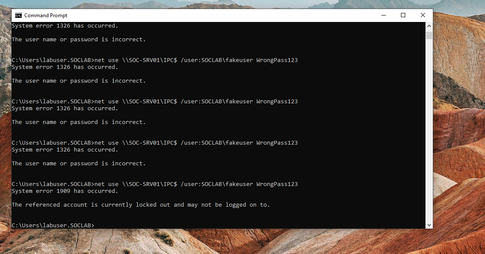
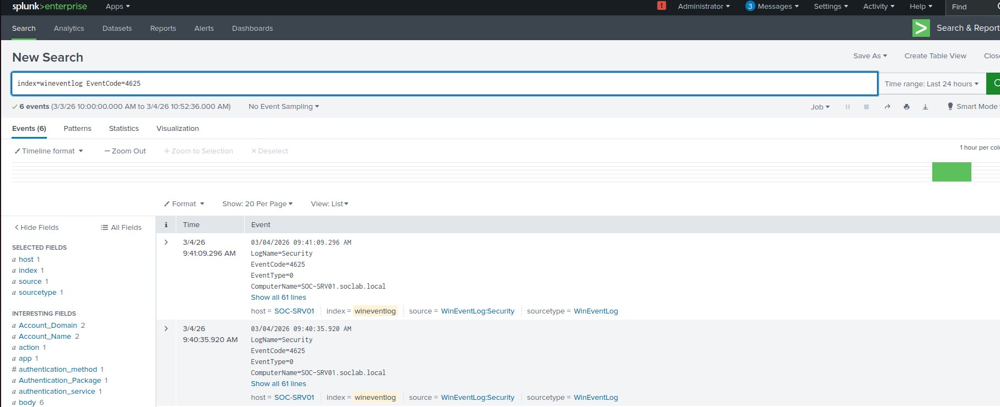
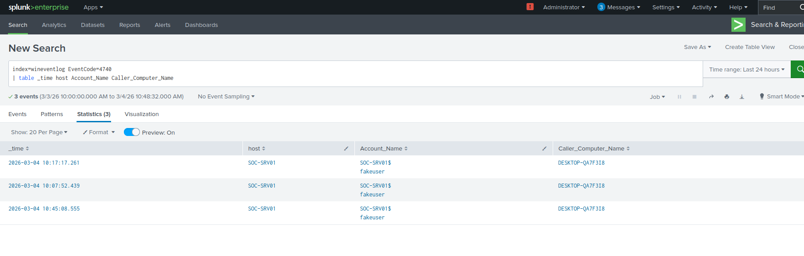
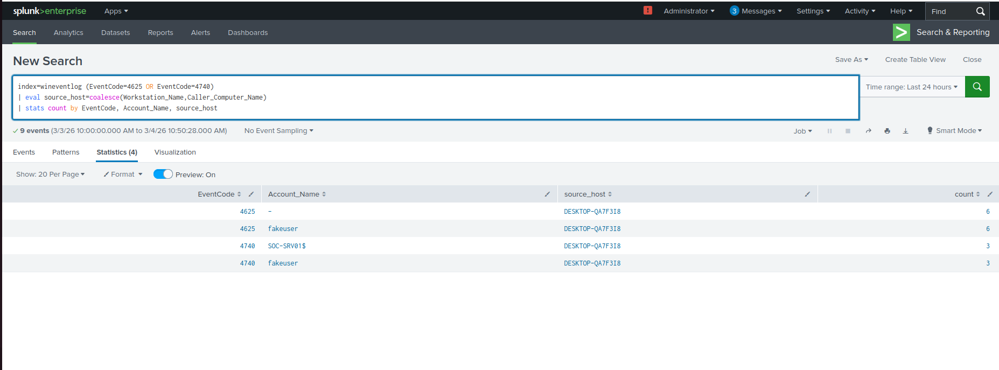
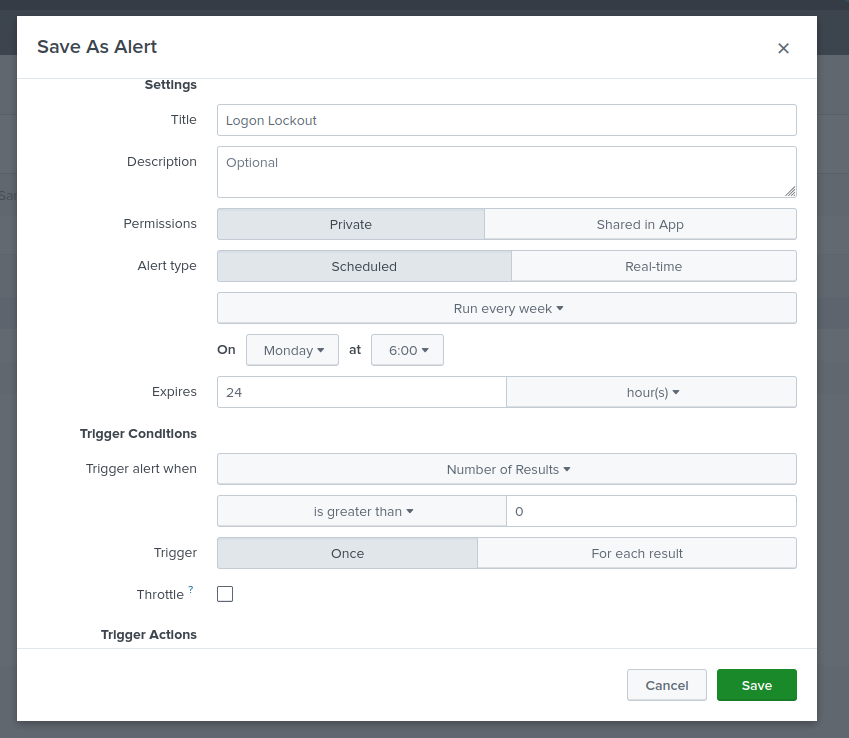

# Active Directory Account Lockout Detection (Splunk Lab)

## Overview

This project simulates repeated failed authentication attempts against an Active Directory user account and demonstrates how account lockouts can be detected using Splunk.

The lab shows how SOC analysts identify suspicious authentication activity that leads to account lockouts.

---

## Lab Environment

- Windows 10 (Domain Joined)
- Windows Server (Domain Controller – SOC-SRV01)
- Splunk Enterprise
- Splunk Universal Forwarder
- VirtualBox Host-Only Network

---

## Attack Simulation

A test user account was created in Active Directory.

Repeated authentication attempts were simulated from a domain workstation using incorrect credentials until the account lockout threshold was reached.

---

## Attack Execution

Command used to simulate failed authentication attempts:

```cmd
for /L %i in (1,1,12) do net use \\SOC-SRV01\IPC$ /user:SOCLAB\fakeuser WrongPass123
```

### Attack Execution Screenshot



---

## Failed Logon Events (Event ID 4625)

The simulated attack generated multiple failed authentication events on the domain controller.

These events are logged as:

```
Event ID 4625 — An account failed to log on
```



---

## Account Lockout Event (Event ID 4740)

After exceeding the configured lockout threshold, the account was locked by Active Directory.

```
Event ID 4740 — A user account was locked out
```



---

## Detection Query

The following Splunk search correlates failed logons with account lockout events.

```spl
index=wineventlog (EventCode=4625 OR EventCode=4740)
| eval source_host=coalesce(Workstation_Name,Caller_Computer_Name)
| stats count by EventCode, Account_Name, source_host
```



---

## Detection Alert

A Splunk alert was created to notify analysts whenever an account lockout event occurs.

```spl
index=wineventlog EventCode=4740
| stats count by Account_Name, Caller_Computer_Name
```

Alert condition:

```
Trigger alert when results > 0
```



---

## MITRE ATT&CK Mapping

Technique:

```
T1110 — Brute Force
```

Sub-techniques:

```
T1110.003 — Password Spraying
```

---

## Detection Summary

This lab demonstrates how SOC analysts can detect account lockouts caused by suspicious authentication activity using centralized log monitoring.

Key indicators include:

- Multiple failed logon attempts (Event ID 4625)
- Account lockout events (Event ID 4740)
- Source workstation generating authentication attempts

---

## Author

Tye Hill

SOC Analyst Home Lab Project
